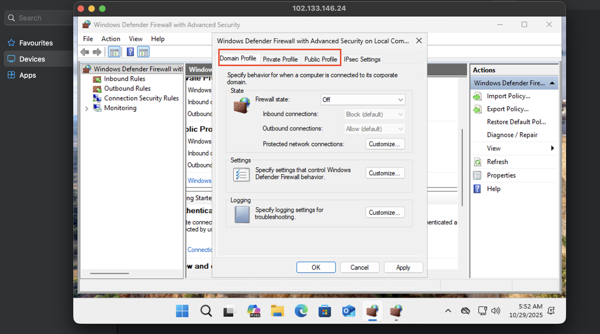
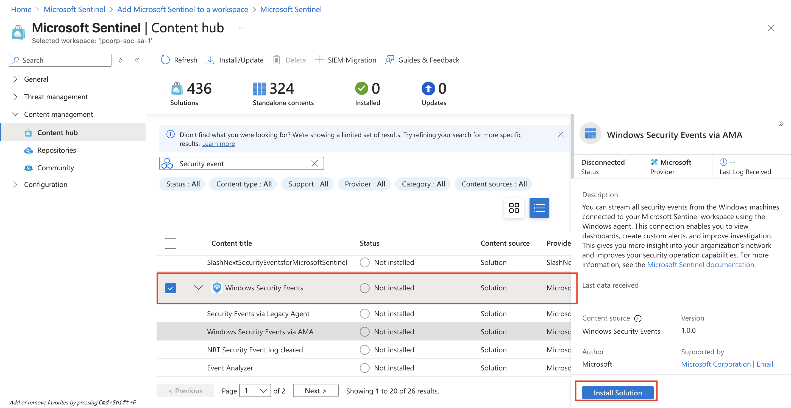
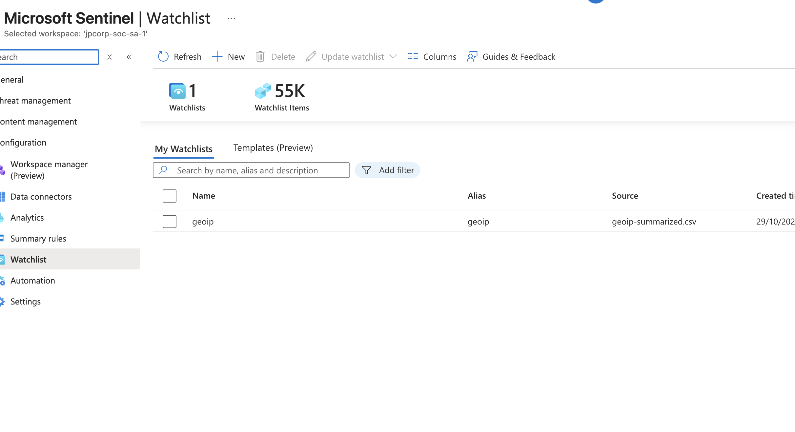

# 🛰️ Azure SIEM Geolocation Simulation

## Overview

This project demonstrates how to build a **Security Information and Event Management (SIEM)** simulation using **Microsoft Azure**.
The setup replicates a real-world environment where a **public-facing Windows Virtual Machine (VM)** is intentionally exposed to the **public internet** to attract real attackers.
The generated attack logs are ingested into **Azure Log Analytics** and visualized in **Microsoft Sentinel**, including **geolocation-based threat mapping**.


This project provides a practical understanding of how Security Operations Centers (SOCs) collect, detect, and visualize cyber threats in real time.

----

## 🧠 Learning Objectives

* Understand how **SIEM systems** collect and correlate security logs.
* Learn how to simulate **real-world cyberattacks** safely.
* Visualize **global attack patterns** using geolocation mapping.
* Build hands-on experience with **Microsoft Sentinel** and **Azure Log Analytics**.

---
## Project Architecture Diagram


### Components:

1. **Public Internet:** Represents real-world attackers scanning and exploiting open ports.
2. **Azure Virtual Machine (VM):** A Windows Server machine exposed to the internet (with the firewall disabled) to simulate attacks.
3. **Network Security Group (NSG):** Disabled or relaxed to allow inbound traffic from the internet.
4. **Log Analytics Workspace:** Collects and stores logs from the VM for monitoring and query analysis.
5. **Microsoft Sentinel (SIEM):** Visualizes data, detects patterns, and displays geolocation of attacks on a world map.

---

## ⚙️ Tools and Technologies

| Component                                   | Purpose                                                         |
| ------------------------------------------- | --------------------------------------------------------------- |
| **Azure Virtual Machine**                   | Host target system to simulate attacks                          |
| **Network Security Group (NSG)**            | Normally protects Azure resources, here disabled for simulation |
| **Azure Log Analytics Workspace**           | Centralized log collection and query platform                   |
| **Microsoft Sentinel (SIEM)**               | Threat detection, visualization, and geolocation mapping        |
| **PowerShell / Kusto Query Language (KQL)** | For querying and analyzing log data                             |
| **Attackers (Public Internet)**             | Simulated real-world scanning and intrusion attempts            |

---

## 🚀 Setup Guide

### **1. Create Azure Resources**

* Create a **Free or Paid Azure Subscription**:
  [https://azure.microsoft.com/en-us/pricing/purchase-options/azure-account](https://azure.microsoft.com/en-us/pricing/purchase-options/azure-account)
* Inside your subscription, create a **Resource Group** and a **Virtual Network (VNet-SoC)**.


### **2. Deploy a Windows Virtual Machine**


* Create a **Windows VM** (In this case, Windows 11).
* During setup:
  * Allow **RDP (port 3389)** and **HTTP (port 80)**.

    
  * Turn off NSG rules for testing and Create a new inbound rule to allow traffic from anywhere.

    

  * Log into the VM via RDP, Disable **Windows Firewall** to expose the machine.
 
    
    
  * Ping the VM via from your local machine
 
    

> ⚠️ *This VM will be publicly accessible. Do not use sensitive credentials or store personal data.*
>
> At the end of this stage, the project's architecture is as shown below:


### **3. Enable Log Collection**

* Go to **Azure Monitor → Logs → Create Log Analytics Workspace (LAW)**. In this case, my LAW is called JPCORP-SoC-SA-1

  

  
  
* Create a **Sentinel Instance** and connect it to Log Analytics.
  
* Configure the **Windows Security Events via AMA** connector

  
  
  

  
* Create the **Data Collection Rule (DCR)** within sentinel, watch for extension creation

    

    
  
    
  
* Query for logs within the LAW to test the connectivity

  

## At the end of this part, the lab architecture is shown below:
  
  

### **4. Generate Logs**

* Leave your VM exposed for a few hours or days.
* Logs will automatically start populating with brute-force, RDP, and network scan attempts.

### **Part 5. Log Enrichment and Finding Location Data**
  * Import a geoipsummarized.csv (as a “Sentinel Watchlist”) which contains geographic information for each block of IP addresses.

    
    
  * Within Sentinel, create the watchlist:

        > Name/Alias: geoip
        > Source type: Local File
        > Search Key: network

  * Allow the watchlist to fully import, there should be a total of roughly 54,000 rows.

    
*In real life, this location data would come from a live source or it would be updated automatically on the back end by your service provider.*

  * At this stage, we can view the location of the attackers based on the IPAddress
    ```kql
    let GeoIPDB_FULL = _GetWatchlist("geoip");
    let WindowsEvents = SecurityEvent;
    WindowsEvents | where EventID == 4625
    | order by TimeGenerated desc
    | evaluate ipv4_lookup(GeoIPDB_FULL, IpAddress, network)
    | summarize FailureCount = count() by IpAddress, latitude, longitude, cityname, countryname
    | project FailureCount, AttackerIp = IpAddress, latitude, longitude, city = cityname, country = countryname,
    friendly_location = strcat(cityname, " (", countryname, ")");
    ```

    

### **6. Attack Map Visualization**

* In **Microsoft Sentinel**, open **Workbooks → Add Workbook → Windows VM Attack Map**.

  
  
* Modify or create your own workbook using **Kusto Query Language (KQL)**:
  ```kql
  let GeoIPDB_FULL = _GetWatchlist("geoip");
  let WindowsEvents = SecurityEvent;
  WindowsEvents | where EventID == 4625
  | order by TimeGenerated desc
  | evaluate ipv4_lookup(GeoIPDB_FULL, IpAddress, network)
  | summarize FailureCount = count() by IpAddress, latitude, longitude, cityname, countryname
  | project FailureCount, AttackerIp = IpAddress, latitude, longitude, city = cityname, country = countryname,
  friendly_location = strcat(cityname, " (", countryname, ")");
  ```

* Visualize the results on a **World Map** to see attack origins.
  
  
---

## 🧩 Possible Enhancements

* Integrate **honeypots** or **custom attack simulation tools** (e.g., Cowrie, HoneyDB).
* Add **alert rules** and **automated incident response** using Sentinel playbooks.
* Extend simulation to **Linux VMs** or **containerized workloads**.
* Export dashboards for presentation or SOC training sessions.

---

## 🧾 License

This project is for **educational and research purposes only**.
Do **not** use this setup in production or on networks containing sensitive data. 
Copyright (c) 2025 Johnson Oje

---

## ✍️ Author

**Johnson Oje**
🔗 [LinkedIn](https://www.linkedin.com/in/johnson-pamilerin-oje/) | 💻 [Portfolio](ojejp.github.io) | 🛡️ Cybersecurity Analyst & Penetration Tester
